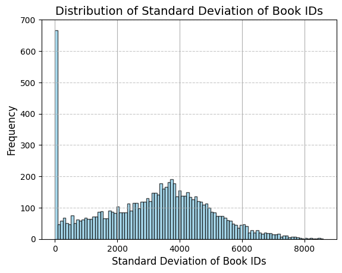

# 📚 EPFL_Apple: Book Recommendation System

## Project Overview

This project investigates and implements multiple recommendation system techniques for a large-scale book dataset. The primary objectives are to analyze user-book interactions, enrich and clean book metadata, and develop both collaborative and content-based recommendation models to improve book suggestions for users.

## Data Sources and Setup

### Datasets
- **interactions_train.csv**: User-book interaction logs (user id `u`, book id `i`, timestamp `t`).
- **items.csv**: Book metadata (title, author, ISBN, publisher, subjects, etc.).
- **books_complete.csv**: Enriched and cleaned book metadata (after merging with external sources).

### Libraries used

- **Data handling**: pandas, numpy
- **Visualization**: matplotlib
- **NLP and text vectorization**: nltk, TfidfVectorizer
- **Dimensionality reduction**: TruncatedSVD
- **Similarity calculations**: cosine_similarity

## Exploratory Data Analysis (EDA)

The notebook `EPFL_Apple_EDA.ipynb` begins with:
- Loading and previewing user interactions and book metadata.
- Counting elements and missing values in the dataset. 
👉 So-What?: This could affect content-based recommendations that rely on textual features like author similarity.

| Feature        | Missing Values |
|---------------|:--------------:|
| Title          | 0              |
| Author         | 2,653          |
| ISBN Valid     | 723            |
| Publisher      | 25             |
| Subjects       | 2,223          |
| i              | 0              |

- Analyzing user activity and statistics: number of books read per user, unique users, and interaction patterns over time.
👉 So-What?: There’s high variability in user behavior (std. dev = 16.4). Some users are extremely active, while others barely engage.
- Visualizing distributions (e.g., standard deviation of book IDs, coefficient of variation, delta between last and max book IDs).

👉 So-What?:
- High peak at 0: around 700 users have a standard deviation close to zero, meaning they likely read only one unique book.  
- Long right tail: a small number of users have very high standard deviations (up to 8000+), indicating wide reading diversity.
- Core cluster (3000–4500): most active users fall in this range, suggesting moderate diversity in book selection.

### Data Enrichment and Cleaning

- Extracted and cleaned ISBNs from book metadata.
- Queried external APIs (e.g., ISBNdb) to enrich book information.
- Normalized and merged API results with the original dataset.
- Cleaned author and publisher fields by removing noise, and handling missing values.
- Combined and cleaned relevant features for use in content-based models.
👉 So-What?: According to the results, the cleaned data didn't improve the results. See details below.

## Collaborative Filtering Approaches
🔍 Idea: Find users who are similar to a target user, and recommend items that those similar users liked (user-to-user).
These models can be found in the file `EPFL_Apple_successful models.ipynb`

### Simple Collaborative Filtering

🛠️ How it works:
- Constructed a binary user-item interaction matrix.
- Calculated cosine similarity between users.
- Generated top-N recommendations for each user based on similar users' reading history.
- Score received from this approach was 0.1515 (better than the threshold, however, not the best).

### Improved Collaborative Filtering with Ranking 
This model enhances the basic CF model by incorporating temporal weighting and adaptive upscaling of book interactions for users with limited activity.

🛠️ How it works:
- Each user's book interactions are **ranked by timestamp** and converted into a **percentile-based score** called `weight`.
- This `weight` acts as a pseudo-rating, emphasizing the relative recency and order of interactions.

#### Example without upscaling (`upscale_low_book = False`):

| User (u) | Book (i) | Time (t) | Weight |
|----------|----------|----------|--------|
| 1        | 500      | 12       | 1.00   |
| 1        | 400      | 11       | 0.75   |
| 1        | 200      | 6        | 0.50   |
| 1        | 300      | 3        | 0.25   |

- Books read more recently are assigned higher weights.
- These `weight` values are later used as inputs to collaborative filtering algorithms, acting as implicit user preferences.
- Achieved Score: 0.1637
- If `upscale_low_book = True` and the user has fewer than or equal to a specified number of unique books (e.g., 2), all weights are upscaled to 1.0. This prevents sparse interaction histories from being undervalued in the similarity computation.

#### Example without upscaling (`upscale_low_book = True`):

| User (u) | Book (i) | Time (t) | Weight |
|----------|----------|----------|--------|
| 1        | 500      | 12       | 1.00   |
| 1        | 500      | 11       | 1.00   |
| 1        | 300      | 6        | 1.00   |
| 1        | 300      | 3        | 1.00   |

## Content-Based Recommendations (TFIDF)
🔍 Idea:TF-IDF stands for Term Frequency-Inverse Document Frequency. It's a text-based feature extraction technique that identifies how important a word is to a particular book relative to the entire book catalog.

🛠️ How it works:
- A new column `combined_features` was created using book metadata: Title, Author, ISBN, Publisher, and Pages.
- Applied *TF-IDF vectorization* on this column to numerically represent each book.
- Used French stop words to clean the text and focus on meaningful content. As the language of the data is French.
- For each user:
  - Computed cosine similarity between the books they’ve read and all other books.
  - Aggregated scores and generated Top-N book recommendations.

👉 So-What?: Surprisingly, *simpler models with fewer metadata features (excluded Subjects, Synopsis, Language, Published date)* produced better performance. Adding too many features likely introduced noise or sparsity into the vector space.

### Naive Filtering (TF-IDF Hybrid)
After investigating the data in `EPFL_Apple_EDA.ipynb`, we spotted some trends in the data, and decided to try to improve the model results by avoid recommending irrelevant books. That is how a **naive filtering rule** was applied after TF-IDF scoring.

🛠️ How it works:
- Applied only to users who read more than 1 book and more than 1 unique book.
- TF-IDF-generated recommendations were filtered to fall within a **book ID range**:
    - Example:
    - User read books with IDs: 100, 105
    - TF-IDF recommendations restricted to IDs between 100 and 111
    - Upper bound capped at 15,290, the maximum book ID in the dataset.

👉 So-What?: This approach got a score of 0.1560 (that is a better score than without the naive approach of 0.1545)

## ✅ Best Model & Interpretation
After evaluating several collaborative filtering strategies, the **best-performing model** in our recommendation system analysis was:

> **User-Based Collaborative Filtering**  
> with `upscale_low_book = True` and `threshold_low_book = 2`
> **Achieved Score**: `0.1642`

- This model provides a strong balance between personalization and inclusivity.
- It gives active users finely tuned recommendations while mitigating the disadvantages for users with limited history.
- The upscaling strategy proves to be effective in boosting precision and overall recommendation quality.

## Results Summary

- Collaborative filtering (user-based) and content-based (TFIDF) approaches were implemented and compared.
- The best-performing models achieved Precision@10 scores 0.1642.
- Data cleaning and enrichment significantly did not improve the quality of recommendations.

| Model               | Precision@10 | Recall@10 | Kaggle |
|---------------------|--------------|-----------|--------|
| User-User CF        | 0.056        | 0.29      |0.1515  |
| Item-Item CF        | 0.059        | 0.28      |0.1508  |
| User-User CF (rank) | 0.06         | 0.29      |0.1642  |

## Additional Experiments
Additional trials and models that were not so successful can be found in the file `EPFL_Apple_other attempts.ipynb`

- Attempted to generate BERT embeddings for book titles and subjects (not fully implemented).
- Explored further collaborative filtering techniques and evaluation strategies.
- Used `GridSearchCV` to tune SVD hyperparameters.

---

## 🖥️ Interface (A Librarian-Facing App)

To bridge insights with real-life usage, we designed and developed an interactive web application using Streamlit. This Book Recommendations App provides users with personalized book recommendations and allows them to explore books based on various search criteria.

You can see our [Book Recommendations App](https://epflapple.streamlit.app/) here

🌟 Key Features:
- Personalized recommendations: suggests books based on user history and similarity scores.
- Search & discovery tools: allows filtering books by user, keywords, authors, or title.
- Visual interface: displays book covers, titles, and metadata with clean UI components.
- Interactive modals: clicking a book opens a detailed popup with descriptions, authorship, and subjects based on data available.

The login function is only a demo. Each time a new session is created the user has to register again.

📌 Note: The login function is only a demo. Each time a new session is created the user has to register again.
---

## 🎬 Video Presentation

There you can find:

📌 The problem: why library users struggle to find relevant books today

💡 Our solution: a recommender engine using collaborative filtering

📈 Results: our best model achieved a MAP@10 of 0.1642, outperforming simpler methods by up to 8%

🖥️ A live demo of our intuitive, Streamlit-powered app for librarians, showing real-time recommendations in action

---

## Acknowledgements

- Data provided by EPFL and external book APIs.
- Libraries: scikit-learn, NLTK, matplotlib, pandas, numpy, streamlit.
- In the process of the project the following AI sources were used: ChatGPT, Copilot, Gemini.

---
For detailed code and outputs, see the notebooks: `EPFL_Apple_EDA.ipynb`, `EPFL_Apple_successful models.ipynb`.
